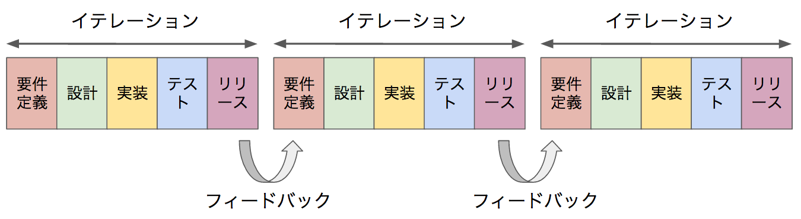
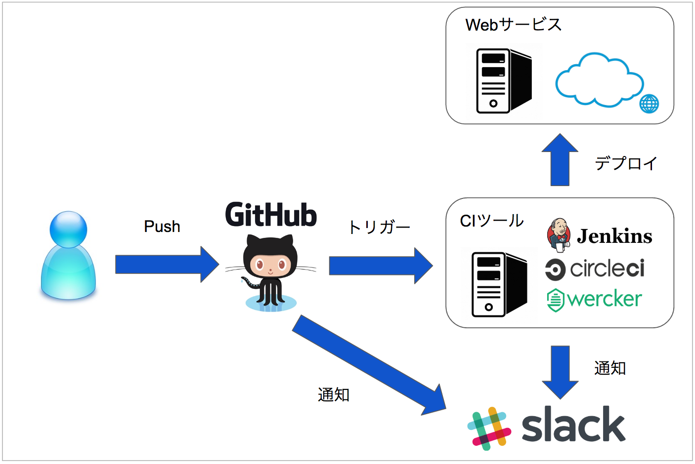
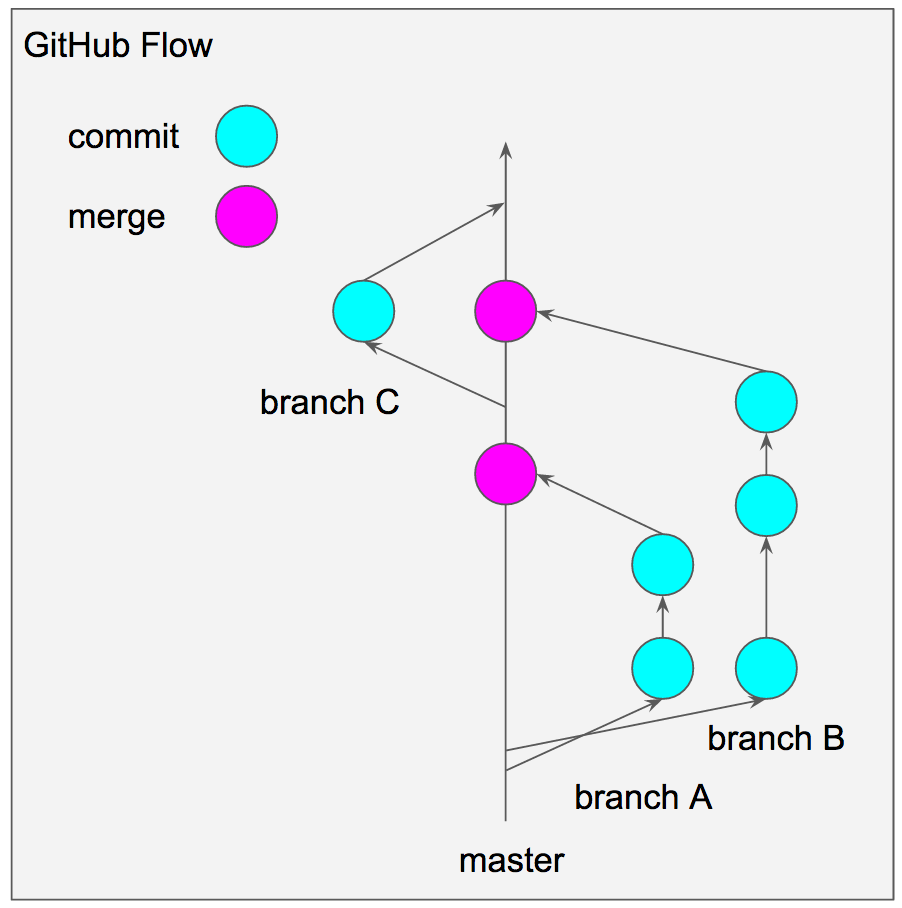

## チーム開発を通して学習すること

- 開発の手法
- git、Githubを使用した開発フロー
- 継続的インテグレーション

 

## 開発手法について

サービス開発において、開発手法はいつくか存在します。 
「ウォーターフォール」、「アジャイル」という手法について簡単に解説します。

 

### ウォーターフォール

- 開発工程を分割し、前の工程が終わらないと先に進まない
- 上流から下流へ一段一段流れるように進めていくことから「ウォーターフォールモデル」と呼ばれている
- 各工程が逐次実施され、前行程への手戻りが少ないため、工程の進捗が管理しやすい
- 下流に進むにつれてシステムが具体的に見えてきた事によるユーザからの仕様変更などに対応する事が困難

 

### アジャイル

- 開発対象となるシステムを機能毎の小さな単位に分割し、「要件定義」「設計」「実装」「テスト」「リリース」といった工程を、分割した単位毎に反復的に行い、小さな機能を1つずつ追加開発していくことで、最終的にシステム全体の開発を行う
- 1週間〜4週間くらいの開発の区切りを「イテレーション」と呼びます
- 計画〜リリースまでを何度も行うため、仕様変更への対応が容易
- 小さな反復を繰り返すため、進捗管理が困難

 

 

## チケット駆動開発

- チケット駆動開発とは、バグ(コンピュータのプログラムにひそむ誤り)や要件とチケットという単位で管理する手法
- チケットでは、担当者、期限、詳細があり、チケットに関する議論のやりとりも残すことが可能
- メンバー全員が全体の状況を把握しやすい

### チケット駆動開発に用いられる主なツール

- <a href="https://ja.atlassian.com/software/jira" target="_blank">JIRA</a>
- <a href="http://redmine.jp/" target="_blank">Redmine</a>
- Githubのissue

 

## 継続的インテグレーション

- 継続的インテグレーションとは、コードのビルドやテストを継続的に実施すること
- CI(Continuous Integration)と呼ばれることが多い
- コードを変更するたびにテストを行う事が可能なため、問題の早期発見に繋がる
- ビルド、テスト、デプロイを自動化することにより、作業コストを減らすことが可能
- 処理結果をチャットツール(Slackなど)に通知することより、リアルタイムで確認することが可能

 

### 主なCIツール

- <a href="https://jenkins.io/" target="_blank">Jenkins</a>
- <a href="https://travis-ci.org/" target="_blank">Travis CI</a>
- <a href="https://circleci.com/" target="_blank">CircleCI</a>
- <a href="http://www.wercker.com/" target="_blank">Wercker</a>

### 構成例

 

## Gitを使用した開発フロー

Railsの実習や課題ついて、GitとGithubを使用して開発してきました。 
Gitを使用した開発フローの中でも特に有名なのが下記の2つとなっています。 

- Github Flow
- git-flow

 

### Github Flowの概要

- masterブランチのものは、いつでもデプロイ出来る状態で無ければならない。(開発中のコードが入っていてはいけない)
- 機能追加等の作業に入る際は、masterからブランチを作成する
- 作成したブランチは、定期的にgithub上へgit pushする
- フィードバックや助言、ブランチのマージをして欲しいときは、github上でpull requestを作成する
- 他のメンバーがレビューをする
- OKが出たら、masterへmargeする
- マージ後は、直ちにデプロイをする(サーバに配置し利用可能な状態とする)

 

### git-flowの概要
- 下記のサイトを参考
- http://qiita.com/KosukeSone/items/514dd24828b485c69a05

今回はGithub Flowに沿って開発していきます。

 

### 設計

Cacoo – 25ページまで無料・日本語サイト
  https://cacoo.com/lang/ja/

Moqups – 無料・ページ制限特になし
  https://moqups.com/

モックアップとは、外見を実物そっくりに似せた模型のこと。
