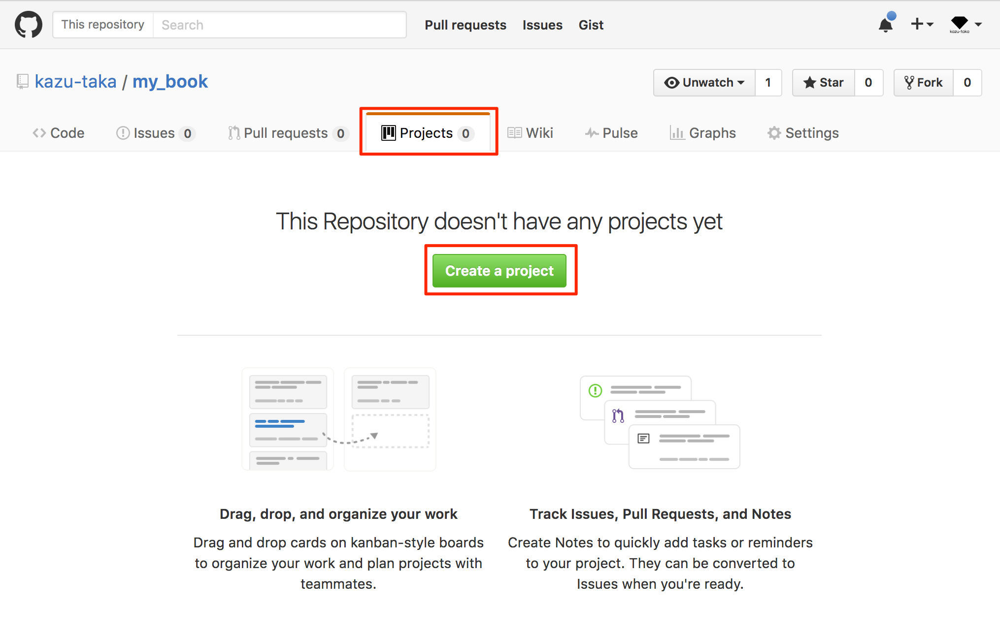
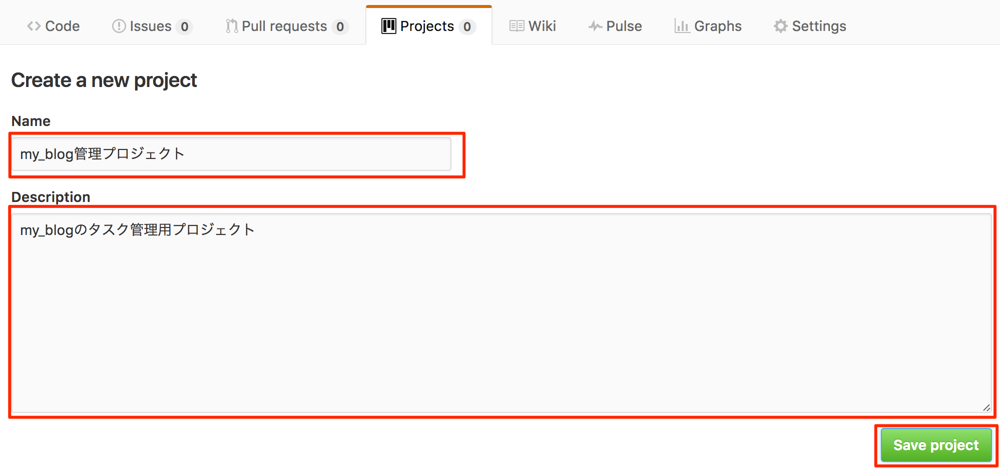
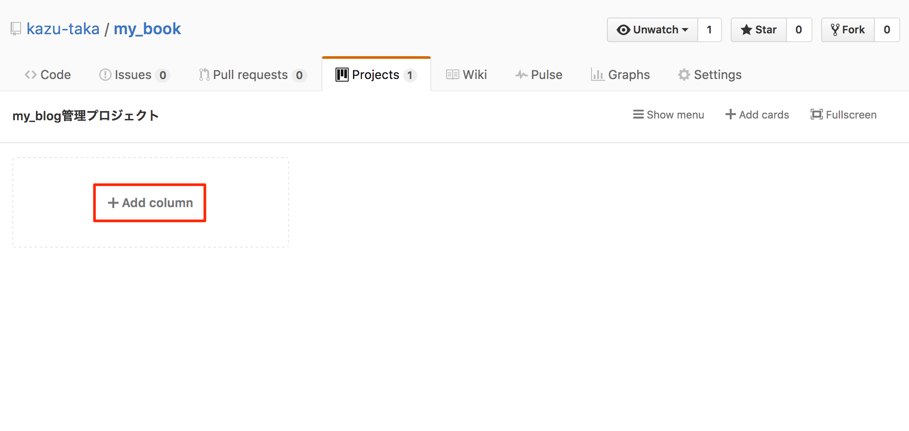
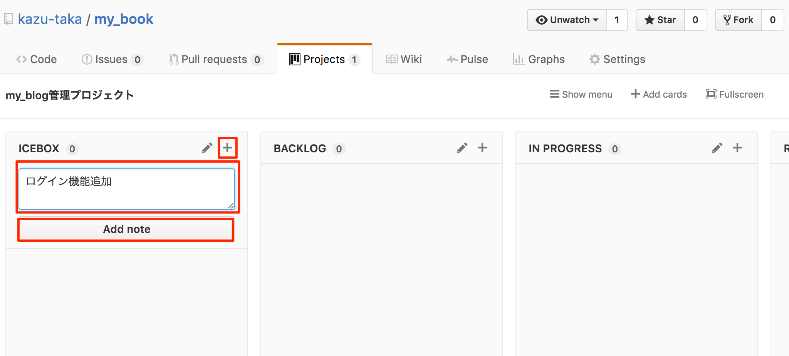
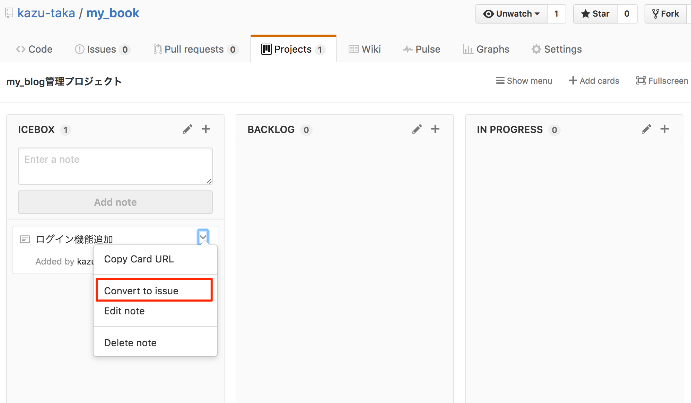
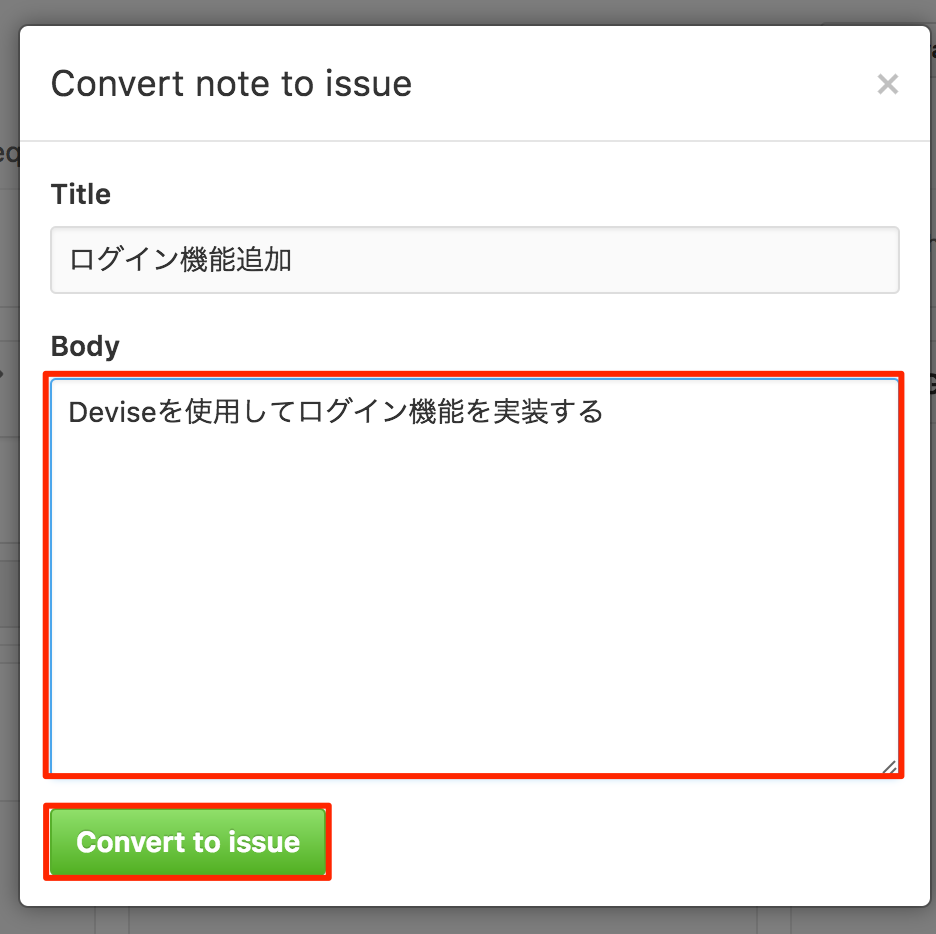
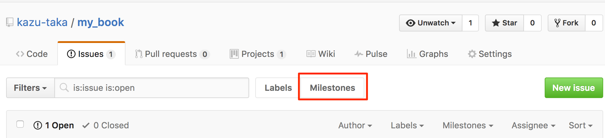
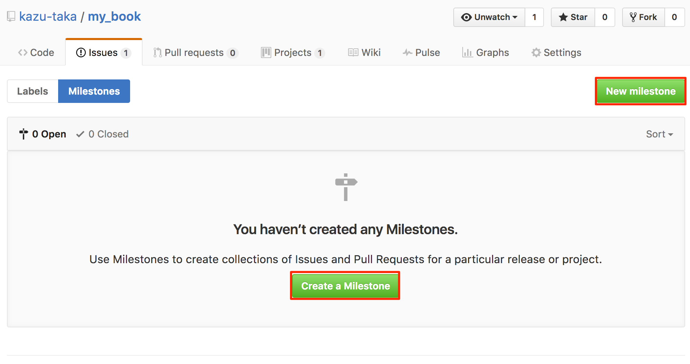
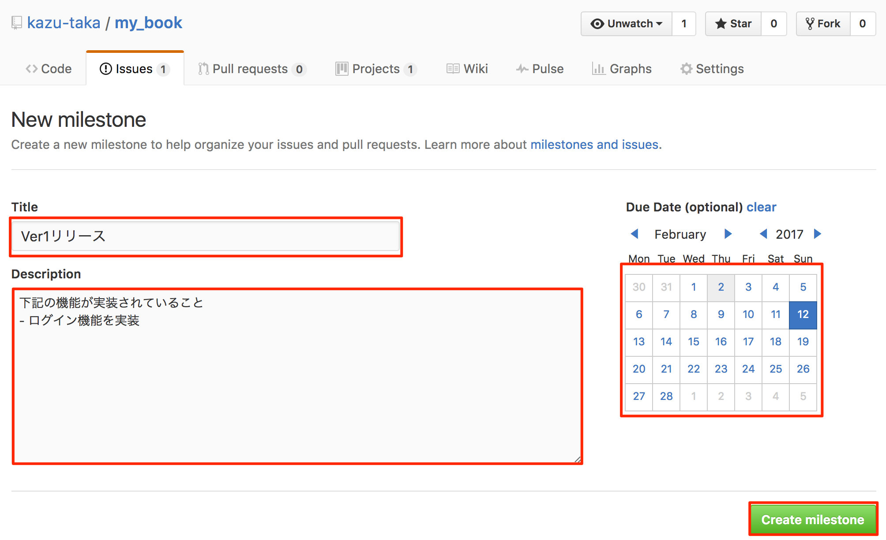
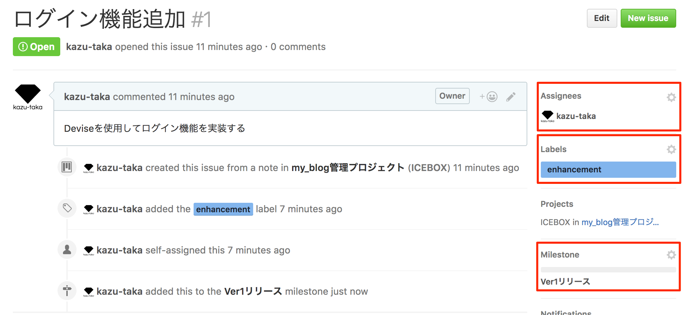

## Githubを使用したタスク管理

GithubのProjectとIssueを使用してタスクを管理していきます。 

 

## Projectの作成〜Issue登録までの流れ
### プロジェクト作成

 

### プロジェクト登録

 

### カラムの追加

プロジェクトによって異なりますが、下記のようなカラムを追加します。
- ICEBOX：誰でもタスクを登録できる。未着手のタスク。
- BACKLOG：着手すると決まったタスク。
- IN PROGRESS：仕掛中のタスク。
- REVIEW：レビュー中のタスク。
- DONE：完了したタスク。

 

### ノート(タスク)の追加

タスクを登録します。

 

### ノートからissueの作成

 

### issueの登録

 

### マイルストーンの作成

マイルストーンとはシステムやソフトウェアの開発において開発の区切りや工程の区切りを指す言葉として使われます。

 

 

### マイルストーンの登録

 
### issueの詳細設定

- Assigness：担当者
- Labels：ラベル
  - bug	バグの場合
  - duplicate	すでに内容の重複したIssueが存在する場合
  - enhancement	機能強化の場合
  - help wanted	助けを求める場合
  - invalid	間違い、勘違い、実現不可の場合。対応しない内容を書いてクローズ
  - question	疑問がある場合
  - wontfix	対応しないバグ等がある場合。対応しない理由を書いてクローズ
- Milestone：期限

